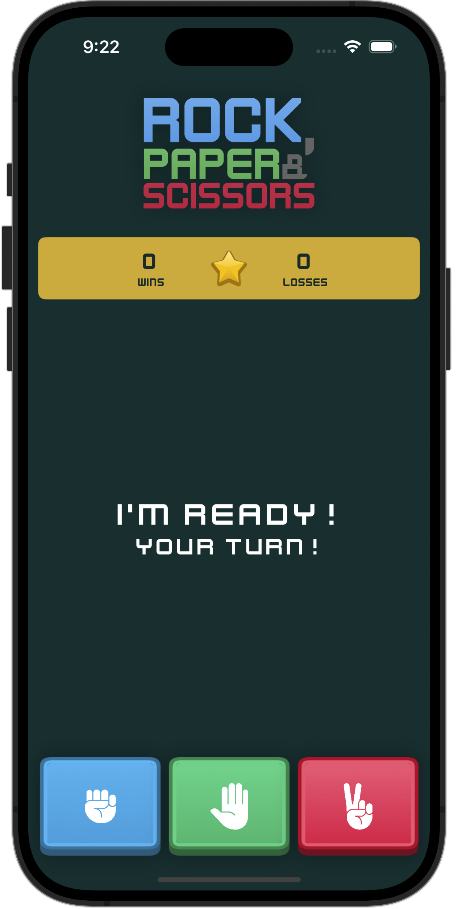
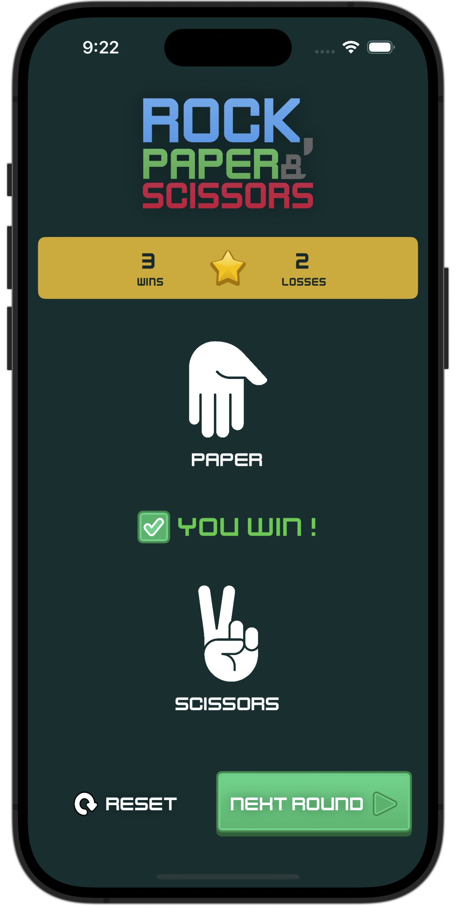

# Rock, Paper & Scissors Game

A simple Rock Paper Scissors game implemented in Swift and SwifUI.

## Features

- Play against the computer.
- Simple and intuitive user interface.
- Keeps track of the score.

## Demo

Here are some screenshots of the game in action:




## Requirements

- iOS 14.0+
- Xcode 12.0+
- Swift 5.0+

## Installation

1. Clone the repository:
  ```sh
  git clone https://github.com/yourusername/rock-paper-scissors.git
  ```
2. Open the project in Xcode:
  ```sh
  cd rock-paper-scissors
  open RockPaperScissors.xcodeproj
  ```
3. Build and run the project on your iOS simulator or device.

## Usage

1. Launch the app.
2. The computer will randomly select its move.
3. Choose your move: Rock, Paper, or Scissors.
4. The winner will be displayed and the score will be updated.

## Future Improvements
- [ ] Add a sound effect for each move.
- [ ] Add animations.
